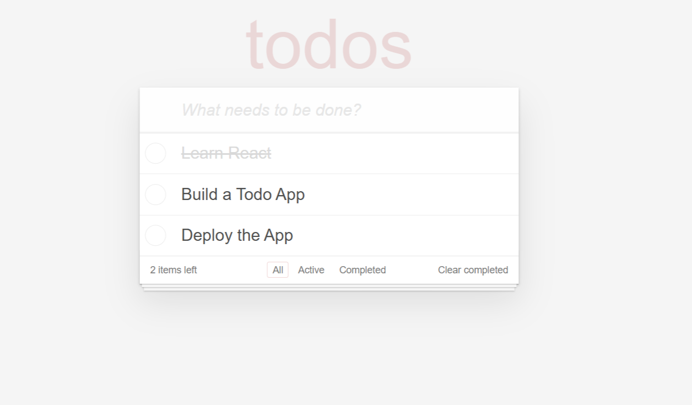

# 📝 React Todo App

A minimal Todo application built with React. It supports adding, toggling, deleting todos, and saves your data in the browser using `localStorage` so your tasks persist between sessions.

---

## 🚀 Features

- ✅ Add new tasks
- 🔁 Mark tasks as complete/incomplete
- ❌ Delete tasks
- 💾 Persistent data using `localStorage`
- 🎯 Simple, clean UI

---

## 📦 Installation

Clone the repository and install dependencies:

```bash
git clone https://github.com/serhatacarhello/todo_list.git
cd todo_list
npm install
npm start
```


